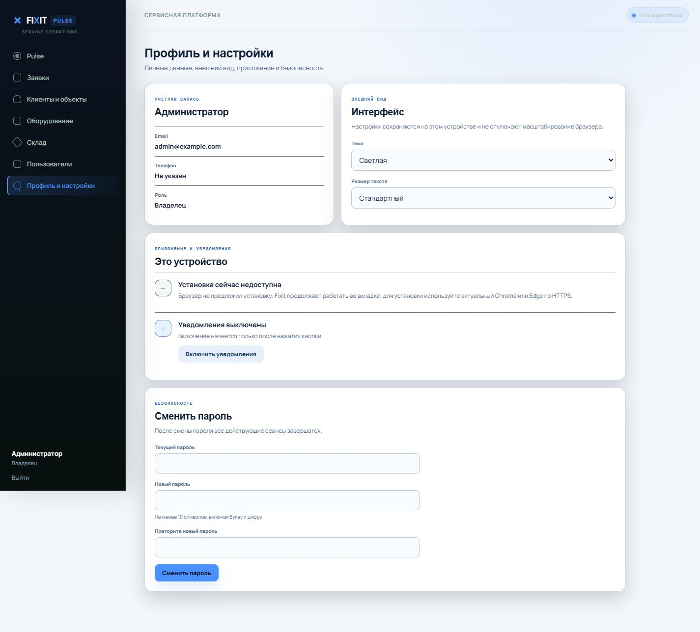
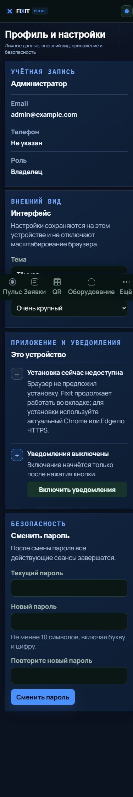

# Профиль, PWA, Web Push и QR: приёмка

## Найденные причины

- Одиночный QR строился прямо в `equipment.py` как «голый» SVG, а массовая
  печать имела отдельную PDF-разметку 90 × 60 мм. Общего шаблона не было.
- Повторная регистрация того же browser endpoint из другой сессии получала
  постоянный `409`, поэтому общий телефон или пропущенный offline-logout уже
  нельзя было корректно подключить снова.
- Клиентское ожидание согласования использовало получателей внутреннего
  согласования. Теперь адресаты выбираются по активному доступу к клиенту и
  объекту, без расширения действующих прав.
- Клиент повторно использовал существующую PushSubscription, не сверяя её
  `applicationServerKey` с текущим VAPID public key. После ротации ключей такая
  подписка выглядела включённой, но отправка не работала.
- Интерфейс не различал permission, наличие browser subscription, серверную
  конфигурацию и ошибку подключения. Из-за этого статус и доступное действие
  могли не соответствовать фактическому состоянию.
- Root-scope worker, обработчики `push`/`notificationclick` и безопасный
  внутренний URL уже были архитектурно пригодны. Для доставки новой логики
  обновлена согласованная версия всех shell-ресурсов, старые shell-кеши
  удаляются при `activate`; IndexedDB и offline-очередь не затрагиваются.

## Реализация

- Раздел «Профиль и настройки» доступен всем авторизованным ролям и показывает
  только пользовательские поля, уже разрешённые `/api/users/me`.
- Тема (`system`, `light`, `dark`) и размер текста (`standard`, `large`,
  `xlarge`) сохраняются локально, применяются до первой отрисовки и не
  блокируют браузерный zoom.
- Смена пароля проверяет текущий пароль и завершает ранее выпущенные сеансы
  через версию авторизации в JWT.
- Восстановление использует одноразовый случайный токен; в БД хранится только
  SHA-256, есть срок действия, блокировка строки при применении, запрет
  повторного использования и одинаковый публичный ответ для любого email.
- Установка PWA показывается только при реальном `beforeinstallprompt`; отдельно
  обработаны standalone, iOS и отсутствие поддержки.
- Push различает `unsupported`, `denied`, `available`, `enabled`,
  `disconnected`, `unconfigured` и `error`; включение начинается только после
  действия пользователя, есть отключение и повторное подключение.
- `equipment_label_pdf.py` — единый источник разметки для одиночной и массовой
  печати. Безопасный адрес остаётся `{PUBLIC_APP_URL}/e/{public_qr_token}`.

## Проверки

- Полный прогон с отдельной PostgreSQL БД и корректным test host:
  **313 passed, 20 skipped**. Пропуски относятся к условным внешним/browser
  сценариям существующего проекта.
- В составе полного прогона — 26 целевых тестов пароля, appearance, PWA/push,
  событий и QR; отдельно после финальной версии ассетов повторены 17
  статических/frontend/public URL тестов.
- Alembic `upgrade head` выполнен на отдельной локальной БД до revision
  `20261002_0018`.
- Экспортированная этикетка отрендерена в 1021 × 681 px и декодирована
  ZXing: получен исходный URL с неизменённым UUID. Проверены длинные названия,
  отсутствующие необязательные поля и размер страницы 90 × 60 мм.
- Node syntax check для `app.js` и `sw.js` пройден.
- Browser QA: 1440 × 1000 и 390 × 844, светлая и тёмная темы, стандартный и
  очень крупный текст, сохранение после reload, keyboard focus order. При
  ширине 390 px `scrollWidth === innerWidth`; горизонтальной прокрутки нет.
- Запрос восстановления неизвестного email проверен в браузере: показывается
  только общий ответ. Ошибка async-form lifecycle, найденная этой проверкой,
  исправлена и повторно проверена.

## Скриншоты





## Настройки production

```env
PUBLIC_APP_URL=https://fixit.example.com
VAPID_PUBLIC_KEY=...
VAPID_PRIVATE_KEY=...
VAPID_SUBJECT=mailto:admin@example.com
PASSWORD_RESET_EXPIRE_MINUTES=30
PASSWORD_RESET_DEBUG=false
SMTP_HOST=smtp.example.com
SMTP_PORT=587
SMTP_USERNAME=...
SMTP_PASSWORD=...
SMTP_FROM_EMAIL=no-reply@example.com
SMTP_USE_TLS=true
```

VAPID public/private должны быть одной парой. `PUBLIC_APP_URL` и PWA должны
работать по HTTPS. `PASSWORD_RESET_DEBUG=true` допустим только локально без
SMTP: он возвращает preview-ссылку для проверяемого сценария.

## Непроверенное физически

Локально нельзя подтвердить доставку через реальный push gateway на закрытый
Android/iOS и системный install prompt конкретного устройства. Серверная
цепочка проверена только тестовыми подписками с замоканным transport; реальных
пользователей и production endpoint тесты не затрагивали. Перед выпуском нужен
короткий smoke-test на одном Android Chrome и одном iPhone Safari по HTTPS.
